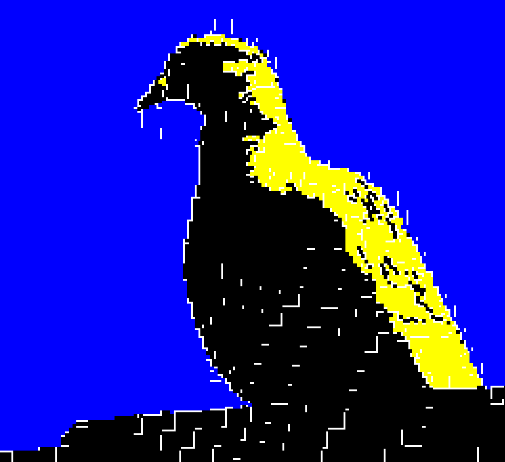

<a name="readme-top"></a>

# Changelog

## Version 0.0.1

### 💄 Styles

- **Fix:** There are gaps when filling with pixels.

<br/>

<details>
<summary><kbd>Improvements and Fixes</kbd></summary>

### Pre-bug fix image generation



### Styles

```python
ff
```

</details>

<div align="right">

[](#readme-top)

</div>
    